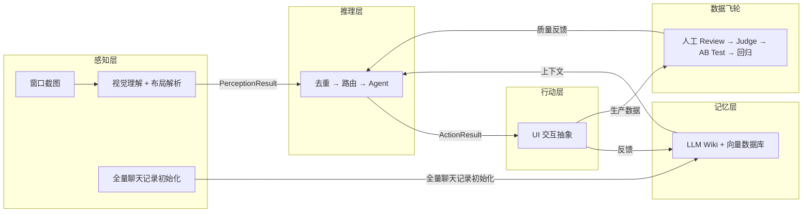
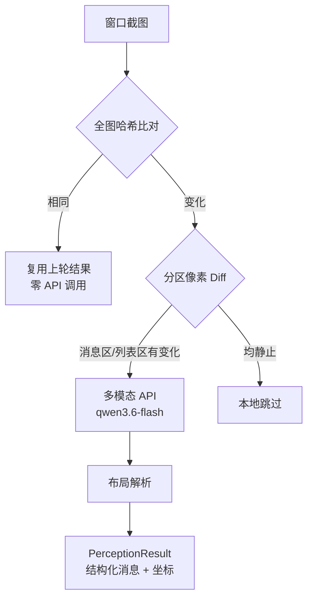
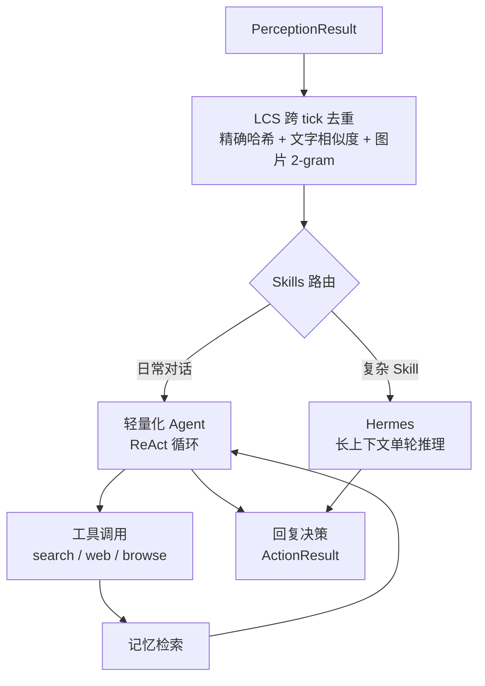
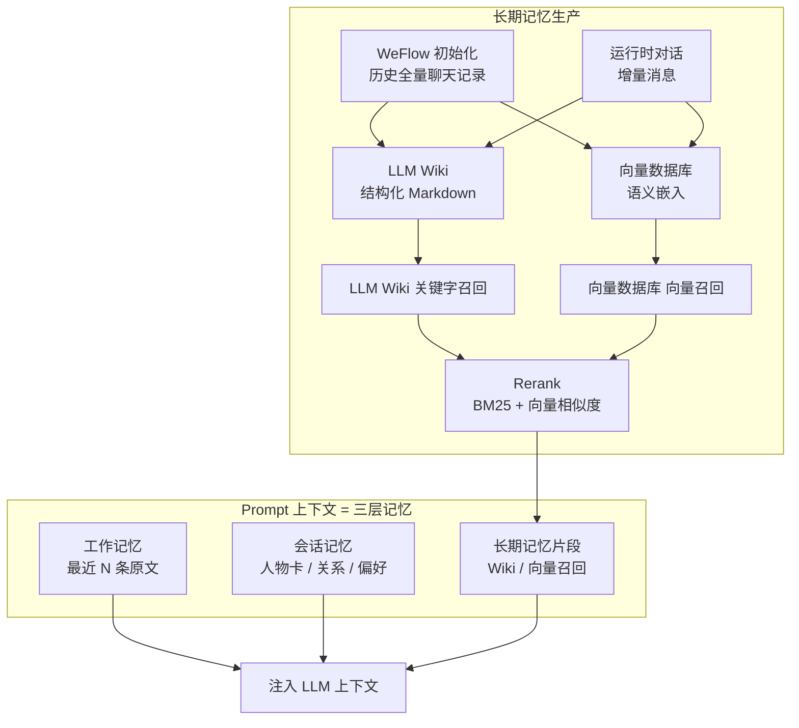
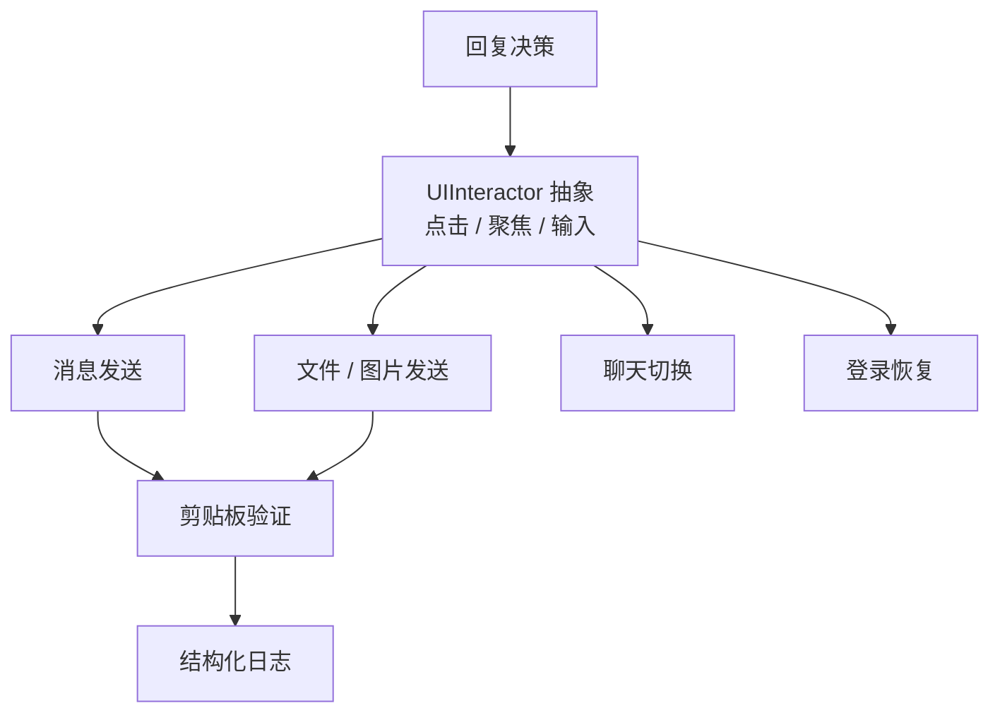
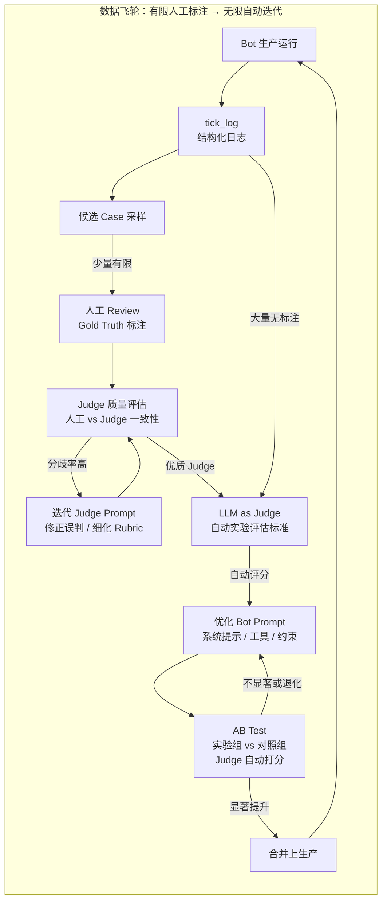

# WeChat Mac RPA


基于**多模态视觉感知**与**LLM Agent**的 macOS 微信自动化框架。不是协议逆向，不是 Hook，不碰微信数据库——我们把微信当作纯黑盒 GUI 应用，用计算机视觉读取界面，用大语言模型理解对话，用系统级自动化操作界面。微信更新 UI 只是换了一套视觉输入，不需要追着协议跑。

核心设计：**感知 → 推理 → 行动 → 记忆 → 数据飞轮**，五个子系统构成完整的认知闭环。每一次认知循环的完整链路都被结构化日志逐条记录，形成**可追溯、可回归、可量化**的生产质量资产。

---

## 系统架构

### 总览：五层认知闭环



---

### 感知层：把像素变成结构化数据

感知层的任务是**忠实还原界面上的文字、布局和状态**，不"理解"对话，只负责提取。

当前两条感知管道并行运行：

- **SmartPipeline**（主力）：本地预判 + 多模态 API 兜底。先用像素 Diff 判断截图是否有实质变化，无变化时零 API 调用直接跳过；有变化时调用多模态大模型提取消息内容。
- **VisionPipeline**（Fallback）：纯本地 OCR 备用管道，在多模态 API 不可用时降级运行。

WeFlowPipeline 不直接参与感知，而是作为**记忆系统的初始化来源**：启动时从微信数据库导出全量历史聊天记录，按聊天聚合后注入 GlobalStore，让 Bot 上线第一天就拥有完整的背景知识。



---

### 推理层：决定说什么、用什么工具

推理层是 Bot 的"大脑"。它不直接操作界面，只决定**说什么**和**用什么工具**。

核心设计是**二级路由**：先用轻量调用判断用户意图是否匹配某个复杂 Skill，再决定投入哪条推理路径。

- **轻量化 Agent**（日常路径）：运行完整的 ReAct 循环——分析意图 → 调用工具 → 观察结果 → 重新推理。Agent 自行决定调用 `search_memory`、`web_search`、`browse_url` 等工具，也可以加载 Skills 进行深度组合推理。
- **Hermes 路径**：匹配到复杂 Skill 且 Hermes 模型可用时，切换长上下文模型，加载完整 Skill 正文进行单轮深度推理，不启用 ReAct 工具循环。



感知层以固定间隔输出一帧消息列表，但聊天历史不会消失——大部分消息在上一轮已经见过。如果 Bot 把旧消息当成新消息，就会重复回复。我们用 **LCS（最长公共子序列）**做跨 tick 消息对齐，对齐基于多维度模糊匹配：精确哈希匹配、文字相似度、图片 2-gram Jaccard 相似度。对齐后只有真正的新消息进入后续流程，旧消息被静默丢弃。

---

### 记忆系统：三层记忆构成完整上下文

Bot 的 prompt 不是只依赖长期 Wiki，而是由**三层记忆**共同组装：工作记忆提供即时上下文，会话记忆提供人物与关系，长期记忆提供跨时间的背景知识。

```
Prompt = 工作记忆（最近对话原文） + 会话记忆（人物 / 关系 / 偏好） + 长期记忆（Wiki / 向量召回）
```

#### 工作记忆（Working Memory）

工作记忆是 Bot 对当前对话的即时感知，通常取**最近 N 条对话原文**（如最近半小时或最近 20 条）。它解决的是"刚才说了什么"的问题：

- 未完成的用户意图与追问链
- 最近的指代、省略、上下文依赖
- 当前活跃的语气、节奏与话题边界

工作记忆直接从 session 存储中按时间窗口截断获取，不做复杂召回，保证时效性和准确性。

#### 会话记忆（Session Memory）

会话记忆描述**当前对话对象和当前会话状态**，通常从长期记忆中实时召回后，以"人物卡"形式固定在 prompt 顶部：

- **基础画像**：对方姓名、身份、与 Bot 的关系（如同事、朋友、家人）
- **社会关系**：家庭成员、同事圈、共同群聊、亲疏层级
- **用户偏好**：沟通风格、常用表达方式、敏感话题、历史忌口
- **会话状态**：当前活跃话题、待跟进事项、已确认/待确认的信息

这一层让 Bot 知道"对面是谁"、"我和ta什么关系"、"现在聊到哪了"。

#### 长期记忆（Long-term Memory）

长期记忆跨越单次会话，保存时间线更长的背景知识。它把 **WeFlow 初始化**和**运行时对话**当作原始输入数据，向上抽象出两个索引层：

- **LLM Wiki**：由 LLM 从原始对话中提炼、结构化的长期事实（按联系人/群聊独立维护），增量更新，标注来源，严禁删除已有内容。
- **向量数据库**：对原始对话做切片和嵌入，提供语义级检索能力。

**原始输入数据**
- **WeFlow 初始化**：Bot 启动时从微信数据库导出全量历史聊天记录，作为初始语料。
- **运行时对话**：每个 tick 感知到的新消息，持续追加到原始数据流中。

**线上多路召回 + Rerank**
- **LLM Wiki 关键字召回**：从结构化 wiki 中做关键词/实体匹配，召回精准事实。
- **向量数据库 向量召回**：从向量索引中做语义相似度召回，捕获同义、上下文相关片段。
- **Rerank 融合排序**：两路结果汇总后，综合 **BM25** 文本相关性和**向量相似度**重新打分，选出 top-k 注入会话记忆或直接使用。

**人工 Overrides**：通过外挂 JSON 实现任意字段覆写，LLM 更新时不会破坏人工修改。

所有数据本地存储，不上传云端。



---

### 行动层：把文本变成界面操作

行动层负责把推理层的决策翻译成对微信 GUI 的实际操作。面对不稳定的 GUI 环境（窗口可能被遮挡、焦点可能丢失、剪贴板可能被污染），我们用 **UIInteractor** 抽象所有坐标级交互，上层 Action 基于该抽象实现，便于替换底层自动化方案。

行动层目前覆盖四类核心动作，均基于同一套 UI 抽象，内置安全机制（frontmost 验证、异常熔断、剪贴板清理）：

- **消息发送**：文本通过 AppleScript 写入剪贴板并粘贴到输入框，发送前做剪贴板内容回读验证。
- **文件/图片发送**：文件通过 AppleScript 将 POSIX 文件对象设置到剪贴板，再粘贴发送；图片发送复用同一剪贴板通道。`send_file` 作为动态工具向 Agent 暴露，可发送 `data/shareable_files.json` 白名单中的文件。
- **聊天切换**：从感知层获取左侧聊天列表项，坐标转换后调用 `cliclick` 点击目标聊天；加入 1 秒全局点击冷却，避免高频连点导致微信窗口布局异常。
- **登录恢复**：检测扫码/掉线弹窗，自动点击登录按钮并等待重连。

Bot 每个 tick 检测并切换到未读数最高的聊天逐个处理，同一目标在短时间内不会重复切换。



---

### 数据飞轮：有限人工标注，无限自动迭代

数据飞轮的精髓不是"人来一条一条修 badcase"，而是**用有限的人工标注成本，换一瓶优质的 LLM as Judge；再用这瓶 Judge 作为自动实验评估标准，无限地迭代 Bot**。

人工 review 是稀缺资源，所以只投在最关键的地方——校准 Judge。一旦 Judge 的打分与人工判断足够一致，它就能接管后续所有 Bot 实验的评估工作：每天产生的大量 tick_log、每一次 prompt 改动、每一个路由策略调整，都可以让 Judge 自动评分，不再需要人逐条过目。



#### 设计思想：Judge 就是 Reward Model

这个数据飞轮的设计思想与 **On-Policy 强化学习**非常相似：

| 数据飞轮 | 强化学习 |
|---|---|
| 少量人工标注 | 人类偏好监督数据 |
| LLM as Judge | Reward Model |
| Bot 回复生成 | Actor |
| Prompt / 工具 / 约束优化 | 策略更新 |
| 新策略上线后继续生产 tick_log | On-Policy：新策略采样新数据 |

区别只在于，这里的 Actor 优化不是通过梯度更新模型参数，而是通过人工分析 reward 信号、调整 prompt / 工具 / 约束等"策略配置"，再用 AB Test 验证新策略是否确实提升了 reward。所以这是一个**人工设计策略 + 自动评估验证**的 on-policy 循环：新策略上线后继续产生新的 tick_log，再采样、标注、校准 Judge，周而复始。

这个类比也解释了为什么 Judge 的质量如此关键：**一个带偏的 Reward Model 会把 Actor 带偏**。只有 Judge 足够可信，Bot 的迭代方向才不会歪。

#### 回路一：用有限人工标注校准 Judge

人工 review 只发生在回路一，且是**少量、有策略的采样标注**。每一例人工标注都被同时用于两件事：训练我们自己对 case 的判断标准，以及评估 Judge 是否跟上了这个标准。

- **Judge 质量评估**：持续对比人工标注与 Judge 评分，计算一致性、误判率、分歧率。分歧率就是 Judge 这瓶"度量衡"的误差。
- **Judge Prompt 迭代**：当分歧率超过阈值时，暂停 Judge 自动评估，分析典型误判模式，迭代 Judge 的 Rubric、示例和边界定义——不是让 Judge 去拟合某一条 case，而是让它的评分标准更贴近人的真实偏好。
- **回归验证**：更新后的 Judge 必须先在 **Judge Quality benchmark** 上通过回归验证，确认它既没有丢失旧能力、也没有引入新偏见，才能重新作为实验评估标准。

#### 回路二：用优质 Judge 无限迭代 Bot

Judge 一旦可信，回路二就可以大规模自动化运转，**人工不再参与逐条评估**。

- **自动质量评估**：每天的生产 tick_log 由 Judge 自动打分，筛选出值得关注的候选 case 供下一轮少量人工抽检；AB Test 中的实验组与对照组由同一版 Judge 评分，保证评估口径一致。
- **根因分析**：从 Judge 评分和抽检样本中提取共性问题，定位是系统提示、工具定义、约束条件还是记忆召回出了问题。
- **通用规则修复**：禁止 case-by-case 打补丁。所有修复必须表达为可复用的规则或配置变更，并在 benchmark 上验证。
- **AB Test 验证**：任何提示词、模型、路由策略的改动，必须先跑 AB Test。只有实验组相比对照组显著提升才允许合并上生产；不显著或退化则回炉重优化。

这就是数据飞轮的杠杆：**人在回路一中投入的每一分钟，都在放大回路二的自动化能力**。Judge 越准，Bot 迭代越快、人工投入越少。

---

## 快速开始

- **环境**：macOS 12+，Python 3.10+，微信 Mac 版
- **依赖**：`pip install -r requirements.txt`
- **配置**：复制 `.env.example` 为 `.env`，填入 API Key
- **启动**：`python3 run_bot.py`
- **管理后台（LaunchAgent 常驻）**：
  ```bash
  # 首次加载（用户登录时自动启动，崩溃自动重启）
  launchctl bootstrap gui/$(id -u) ~/Library/LaunchAgents/com.wechat-mac-rpa.admin.plist
  launchctl enable gui/$(id -u)/com.wechat-mac-rpa.admin
  launchctl kickstart gui/$(id -u)/com.wechat-mac-rpa.admin
  ```
  常用操作：
  - 查看状态：`launchctl list | grep com.wechat-mac-rpa.admin`
  - 手动重启：`launchctl kickstart -k gui/$(id -u)/com.wechat-mac-rpa.admin`
  - 停止服务：`launchctl bootout gui/$(id -u)/com.wechat-mac-rpa.admin`
  - 日志：`tail -f logs/admin-launchd.log logs/admin.log`
  - 前台调试用：`python3 scripts/admin.py`
- **测试**：`python3 -m pytest src/tests/test_*_benchmark.py -v`
- **OCR Benchmark**：`python3 src/tests/test_ocr_quality_benchmark.py`
- **生成报告**：`python3 scripts/generate_ocr_benchmark_report.py`

详细安装与配置指南见 `docs/01-quickstart/AI_QUICKSTART.md`。

---

## 工程基础设施

- **Benchmark Dashboard**：自动生成可视化报告，汇总各 benchmark 的历史趋势与当前状态
- **管理后台**：内置 FastAPI 开发者后台（`scripts/admin.py`），提供 Dashboard、Tick 查看、人工标注、截图 OCR、Benchmark 报告、实验管理
- **全链路 Profile**：整个链路植入统一的性能打点，覆盖截图、OCR、布局、生成、记忆、发送各阶段

---

## Benchmark 状态

**任何 prompt 修改、模型切换、感知层逻辑变更，必须先跑 benchmark 验证，禁止直接上生产。**

现有 9 个 benchmark，覆盖核心链路：

| Benchmark | Cases | 评估方式 | 当前状态 |
|-----------|-------|---------|---------|
| **Reply Quality** | 24 | LLM-as-a-Judge + 自定义 Rubric | ✅ 100% |
| **Reply Stability** | — | 多轮重复一致性检验 | — |
| **Tool Decision** | 27 | Binary + Judge Rubric（对抗性 case） | 🟡 81.5% |
| **Memory Search** | 29 | Precision / Recall / F1 | 🟡 96.6% |
| **Chat List Unread** | 23 | Precision / Recall | ✅ 100% |
| **OCR Quality** | 33 | Sender / Text / ChatName / Count | 🟡 81.8% |
| **Judge Quality** | 18 | Meta-benchmark：评估 Judge LLM 自身准确率 | — |
| **Judge Quality v2** | — | 多维度 Rubric 评估 | — |
| **Reply Quality v2** | — | 回复质量多维度评估 | — |

开发流程：

```
Badcase → Benchmark 复现 → 根因分析 → 通用规则修复 → Benchmark 回归验证 → 上生产
```

---

## 项目结构

```
wechat-mac-rpa/
├── src/
│   ├── bot/               # L5: 主循环编排
│   ├── perception/        # L3.5: SmartPipeline / VisionPipeline / WeFlowPipeline
│   ├── layout/            # L3: 布局解析
│   ├── message/           # L3: 消息提取
│   ├── session/           # L4: 全局消息存储（LCS 去重 + 持久化）
│   ├── reply/             # L4: 回复生成（Agent 运行时 + 双模型路由）
│   ├── memory/            # L4: 记忆系统（工作 / 会话 / 长期记忆 + LLM Wiki + Overrides）
│   ├── tools/             # L4: 工具注册 + 内置工具
│   ├── action/            # L4: UI 交互 / 消息发送 / 聊天切换 / 登录恢复
│   ├── capture/           # L2: 窗口截图
│   ├── ocr/               # L2: macOS Vision 文字识别
│   ├── models/            # L1: 领域模型
│   ├── llm/               # LLM 客户端（Kimi 本地代理 / DashScope API）
│   ├── logging/           # 结构化日志与全链路追踪
│   ├── utils/             # L1-L5 共享工具
│   ├── badcase/           # Badcase 闭环（数据库 / 生成器 / Judge / 审核）
│   └── tests/             # 9 个 benchmark 套件 + 单元测试
├── tests_integration/     # 集成测试（真实截图 + 端到端）
├── scripts/               # 后台 / Dashboard 生成 / 实验框架 / 数据迁移
├── docs/                  # 完整文档体系
│   ├── 01-quickstart/
│   ├── 02-architecture/
│   ├── 03-guides/
│   ├── 04-troubleshooting/
│   └── 05-meta/
├── data/                  # 运行时数据（gitignored）
│   ├── debug/             # tick 级 debug JSON
│   ├── logs/              # 运行日志
│   ├── screenshots/       # 截图存档
│   ├── memory/wiki/       # 用户/群聊/话题 wiki
│   ├── benchmark_history/ # Benchmark 历史数据
│   ├── experiments/       # 实验结果归档
│   └── cases.db           # Badcase 核心数据库
├── prompts/               # 系统 prompt 模板
├── skills/                # 可插拔 Skill（Markdown）
├── models/                # 模型配置与缓存
└── run_bot.py             # 生产环境入口
```

---

## 文档索引

| 文档 | 说明 |
|------|------|
| [快速开始](docs/01-quickstart/AI_QUICKSTART.md) | 环境配置、依赖安装、首次启动 |
| [架构设计](docs/02-architecture/ARCHITECTURE.md) | L1-L5 分层架构、依赖规则、边界约束 |
| [API 接口速查](docs/02-architecture/API_SURFACE.md) | 当前生产代码的公共接口，可直接复制粘贴 |
| [模块索引](docs/02-architecture/MODULE_INDEX.md) | "消息识别错了"→改哪个文件 |
| [编码原则](docs/02-architecture/CODING_PRINCIPLES.md) | 类型注解、单一职责、单向依赖 |
| [项目进度](docs/03-guides/PROJECT_STATUS.md) | 当前状态、活跃问题、benchmark 结果 |
| [性能优化 Spec](docs/02-architecture/specs/PERFORMANCE_SPEC.md) | 全链路 profiling 点、瓶颈分析、优化方案 |
| [踩坑记录](docs/04-troubleshooting/LESSONS_LEARNED.md) | 历史教训、常见错误模式 |

---

## 免责声明

本项目仅用于个人学习和研究目的。使用自动化工具操作微信可能违反微信用户协议，请自行评估风险。本项目作者不对任何使用后果负责。
