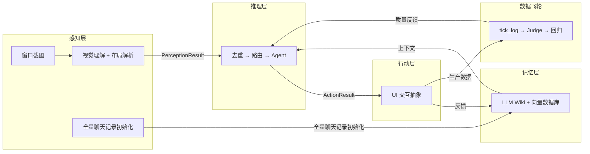
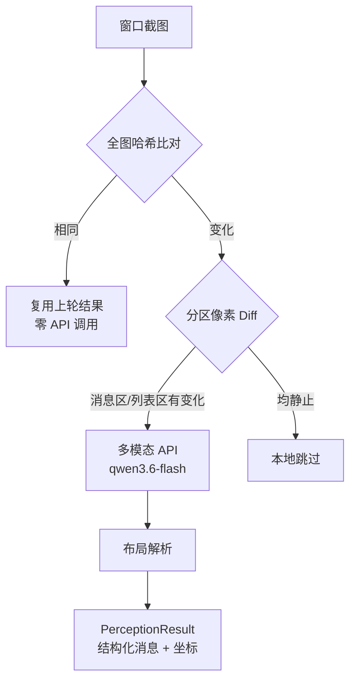
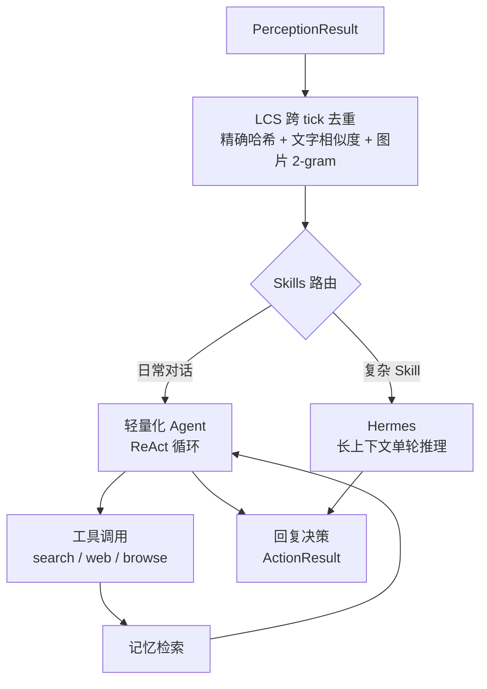
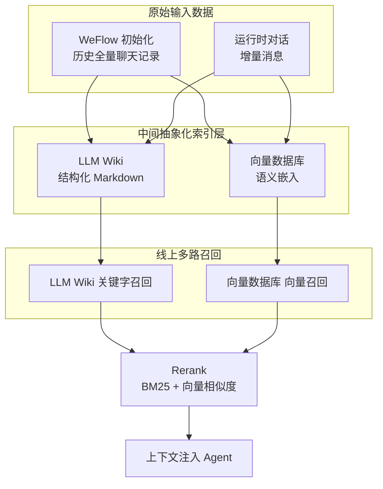
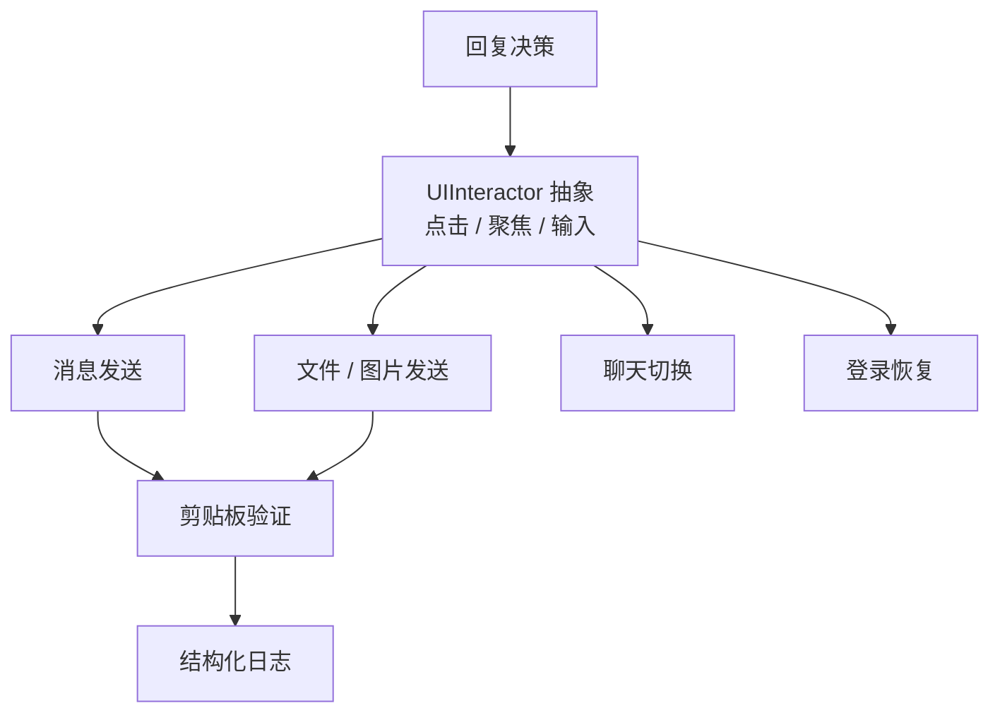
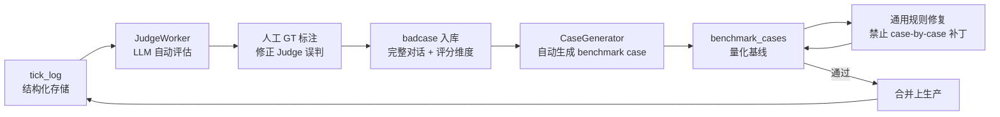

# WeChat Mac RPA


基于**多模态视觉感知**与**LLM Agent**的 macOS 微信自动化框架。不是协议逆向，不是 Hook，不碰微信数据库——我们把微信当作纯黑盒 GUI 应用，用计算机视觉读取界面，用大语言模型理解对话，用系统级自动化操作界面。微信更新 UI 只是换了一套视觉输入，不需要追着协议跑。

核心设计：**感知 → 推理 → 行动 → 记忆 → 数据飞轮**，五个子系统构成完整的认知闭环。每一次认知循环的完整链路都被结构化日志逐条记录，形成**可追溯、可回归、可量化**的生产质量资产。

---

## 系统架构

### 总览：五层认知闭环



---

### 感知层：把像素变成结构化数据

感知层的任务是**忠实还原界面上的文字、布局和状态**，不"理解"对话，只负责提取。

当前两条感知管道并行运行：

- **SmartPipeline**（主力）：本地预判 + 多模态 API 兜底。先用像素 Diff 判断截图是否有实质变化，无变化时零 API 调用直接跳过；有变化时调用多模态大模型提取消息内容。
- **VisionPipeline**（Fallback）：纯本地 OCR 备用管道，在多模态 API 不可用时降级运行。

WeFlowPipeline 不直接参与感知，而是作为**记忆系统的初始化来源**：启动时从微信数据库导出全量历史聊天记录，按聊天聚合后注入 GlobalStore，让 Bot 上线第一天就拥有完整的背景知识。



---

### 推理层：决定说什么、用什么工具

推理层是 Bot 的"大脑"。它不直接操作界面，只决定**说什么**和**用什么工具**。

核心设计是**二级路由**：先用轻量调用判断用户意图是否匹配某个复杂 Skill，再决定投入哪条推理路径。

- **轻量化 Agent**（日常路径）：运行完整的 ReAct 循环——分析意图 → 调用工具 → 观察结果 → 重新推理。Agent 自行决定调用 `search_memory`、`web_search`、`browse_url` 等工具，也可以加载 Skills 进行深度组合推理。
- **Hermes 路径**：匹配到复杂 Skill 且 Hermes 模型可用时，切换长上下文模型，加载完整 Skill 正文进行单轮深度推理，不启用 ReAct 工具循环。



感知层以固定间隔输出一帧消息列表，但聊天历史不会消失——大部分消息在上一轮已经见过。如果 Bot 把旧消息当成新消息，就会重复回复。我们用 **LCS（最长公共子序列）**做跨 tick 消息对齐，对齐基于多维度模糊匹配：精确哈希匹配、文字相似度、图片 2-gram Jaccard 相似度。对齐后只有真正的新消息进入后续流程，旧消息被静默丢弃。

---

### 记忆系统：多路召回 + Rerank

记忆系统不是简单的“每个联系人一个 Wiki”。它把 **WeFlow 初始化**和**运行时对话**当作原始输入数据，向上抽象出两个索引层：**LLM Wiki**（结构化 Markdown）和**向量数据库**（语义向量）。线上召回时两路并行，最终通过 Rerank 融合排序，把最相关的片段注入 Agent 上下文。

- **原始输入数据**
  - **WeFlow 初始化**：Bot 启动时从微信数据库导出全量历史聊天记录，作为初始语料。
  - **运行时对话**：每个 tick 感知到的新消息，持续追加到原始数据流中。
- **中间抽象化索引层**
  - **LLM Wiki**：由 LLM 从原始对话中提炼、结构化的长期事实（按联系人/群聊独立维护），增量更新，标注来源，严禁删除已有内容。
  - **向量数据库**：对原始对话做切片和嵌入，提供语义级检索能力。
- **线上多路召回**
  - **LLM Wiki 关键字召回**：从结构化 wiki 中做关键词/实体匹配，召回精准事实。
  - **向量数据库 向量召回**：从向量索引中做语义相似度召回，捕获同义、上下文相关片段。
- **Rerank 融合排序**
  - 两路结果汇总后，综合 **BM25** 文本相关性和**向量相似度**重新打分，选出 top-k 注入 Agent 上下文。
- **人工 Overrides**：通过外挂 JSON 实现任意字段覆写，LLM 更新时不会破坏人工修改。

所有数据本地存储，不上传云端。



---

### 行动层：把文本变成界面操作

行动层负责把推理层的决策翻译成对微信 GUI 的实际操作。面对不稳定的 GUI 环境（窗口可能被遮挡、焦点可能丢失、剪贴板可能被污染），我们用 **UIInteractor** 抽象所有坐标级交互，上层 Action 基于该抽象实现，便于替换底层自动化方案。

行动层目前覆盖四类核心动作，均基于同一套 UI 抽象，内置安全机制（frontmost 验证、异常熔断、剪贴板清理）：

- **消息发送**：文本通过 AppleScript 写入剪贴板并粘贴到输入框，发送前做剪贴板内容回读验证。
- **文件/图片发送**：文件通过 AppleScript 将 POSIX 文件对象设置到剪贴板，再粘贴发送；图片发送复用同一剪贴板通道。`send_file` 作为动态工具向 Agent 暴露，可发送 `data/shareable_files.json` 白名单中的文件。
- **聊天切换**：从感知层获取左侧聊天列表项，坐标转换后调用 `cliclick` 点击目标聊天；加入 1 秒全局点击冷却，避免高频连点导致微信窗口布局异常。
- **登录恢复**：检测扫码/掉线弹窗，自动点击登录按钮并等待重连。

Bot 每个 tick 检测并切换到未读数最高的聊天逐个处理，同一目标在短时间内不会重复切换。



---

### 数据飞轮：生产质量闭环

Bot 上线不是终点，而是数据积累的开始。与传统"散落 JSON + 手动归档"不同，我们的闭环以 **SQLite 数据库**为核心，将每一条生产异常转化为可回归的 case 资产。



**JudgeWorker** 是闭环的关键齿轮。它是一个异步后台服务，消费 tick_log 中的生产记录，按结构化 Rubric 多维度打分——相关性、准确性、语气、克制、工具使用。每条评分都附带详细理由，可追溯、可质疑、可修正。人工与 Judge 的分歧率持续监控，超过阈值时暂停自动评估，等待人工复核。

随着 case 库的增长，Bot 的鲁棒性持续提升。不是"修完就忘"，而是形成**可追溯、可回归的生产质量资产**。

---

## 快速开始

- **环境**：macOS 12+，Python 3.10+，微信 Mac 版
- **依赖**：`pip install -r requirements.txt`
- **配置**：复制 `.env.example` 为 `.env`，填入 API Key
- **启动**：`python3 run_bot.py`
- **管理后台（LaunchAgent 常驻）**：
  ```bash
  # 首次加载（用户登录时自动启动，崩溃自动重启）
  launchctl bootstrap gui/$(id -u) ~/Library/LaunchAgents/com.wechat-mac-rpa.admin.plist
  launchctl enable gui/$(id -u)/com.wechat-mac-rpa.admin
  launchctl kickstart gui/$(id -u)/com.wechat-mac-rpa.admin
  ```
  常用操作：
  - 查看状态：`launchctl list | grep com.wechat-mac-rpa.admin`
  - 手动重启：`launchctl kickstart -k gui/$(id -u)/com.wechat-mac-rpa.admin`
  - 停止服务：`launchctl bootout gui/$(id -u)/com.wechat-mac-rpa.admin`
  - 日志：`tail -f logs/admin-launchd.log logs/admin.log`
  - 前台调试用：`python3 scripts/admin.py`
- **测试**：`python3 -m pytest src/tests/test_*_benchmark.py -v`
- **OCR Benchmark**：`python3 src/tests/test_ocr_quality_benchmark.py`
- **生成报告**：`python3 scripts/generate_ocr_benchmark_report.py`

详细安装与配置指南见 `docs/01-quickstart/AI_QUICKSTART.md`。

---

## Benchmark 状态

**任何 prompt 修改、模型切换、感知层逻辑变更，必须先跑 benchmark 验证，禁止直接上生产。**

现有 9 个 benchmark，覆盖核心链路：

| Benchmark | Cases | 评估方式 | 当前状态 |
|-----------|-------|---------|---------|
| **Reply Quality** | 24 | LLM-as-a-Judge + 自定义 Rubric | ✅ 100% |
| **Reply Stability** | — | 多轮重复一致性检验 | — |
| **Tool Decision** | 27 | Binary + Judge Rubric（对抗性 case） | 🟡 81.5% |
| **Memory Search** | 29 | Precision / Recall / F1 | 🟡 96.6% |
| **Chat List Unread** | 23 | Precision / Recall | ✅ 100% |
| **OCR Quality** | 33 | Sender / Text / ChatName / Count | 🟡 81.8% |
| **Judge Quality** | 18 | Meta-benchmark：评估 Judge LLM 自身准确率 | — |
| **Judge Quality v2** | — | 多维度 Rubric 评估 | — |
| **Reply Quality v2** | — | 回复质量多维度评估 | — |

开发流程：

```
Badcase → Benchmark 复现 → 根因分析 → 通用规则修复 → Benchmark 回归验证 → 上生产
```

---

## AB 实验框架

生产环境的改动不能凭直觉上线，必须用实验量化验证。实验框架支持对比不同 prompt、模型、路由策略的效果，实验结果自动归档到 `data/experiments/`。

- **实验设计**：每条实验定义实验组配置和对照组（`all_off` 基线），同批 case 跑两组，Judge 评分后对比 badcase 率。
- **消融实验**：`no_time`、`no_restraint`、`no_dedup` 等实验逐个关闭功能，精确衡量每个功能的质量贡献。
- **自动迭代**：支持多轮实验自动运行，逐轮开启功能，直到找到最优组合。

---

## 工程基础设施

- **Benchmark Dashboard**：自动生成可视化报告，汇总各 benchmark 的历史趋势与当前状态
- **管理后台**：内置 FastAPI 开发者后台（`scripts/admin.py`），提供 Dashboard、Tick 查看、人工标注、截图 OCR、Benchmark 报告、实验管理
- **全链路 Profile**：整个链路植入统一的性能打点，覆盖截图、OCR、布局、生成、记忆、发送各阶段

---

## 项目结构

```
wechat-mac-rpa/
├── src/
│   ├── bot/               # L5: 主循环编排
│   ├── perception/        # L3.5: SmartPipeline / VisionPipeline / WeFlowPipeline
│   ├── layout/            # L3: 布局解析
│   ├── message/           # L3: 消息提取
│   ├── session/           # L4: 全局消息存储（LCS 去重 + 持久化）
│   ├── reply/             # L4: 回复生成（Agent 运行时 + 双模型路由）
│   ├── memory/            # L4: 长期记忆（LLM Wiki + Overrides）
│   ├── tools/             # L4: 工具注册 + 内置工具
│   ├── action/            # L4: UI 交互 / 消息发送 / 聊天切换 / 登录恢复
│   ├── capture/           # L2: 窗口截图
│   ├── ocr/               # L2: macOS Vision 文字识别
│   ├── models/            # L1: 领域模型
│   ├── llm/               # LLM 客户端（Kimi 本地代理 / DashScope API）
│   ├── logging/           # 结构化日志与全链路追踪
│   ├── utils/             # L1-L5 共享工具
│   ├── badcase/           # Badcase 闭环（数据库 / 生成器 / Judge / 审核）
│   └── tests/             # 9 个 benchmark 套件 + 单元测试
├── tests_integration/     # 集成测试（真实截图 + 端到端）
├── scripts/               # 后台 / Dashboard 生成 / 实验框架 / 数据迁移
├── docs/                  # 完整文档体系
│   ├── 01-quickstart/
│   ├── 02-architecture/
│   ├── 03-guides/
│   ├── 04-troubleshooting/
│   └── 05-meta/
├── data/                  # 运行时数据（gitignored）
│   ├── debug/             # tick 级 debug JSON
│   ├── logs/              # 运行日志
│   ├── screenshots/       # 截图存档
│   ├── memory/wiki/       # 用户/群聊/话题 wiki
│   ├── benchmark_history/ # Benchmark 历史数据
│   ├── experiments/       # 实验结果归档
│   └── cases.db           # Badcase 核心数据库
├── prompts/               # 系统 prompt 模板
├── skills/                # 可插拔 Skill（Markdown）
├── models/                # 模型配置与缓存
└── run_bot.py             # 生产环境入口
```

---

## 文档索引

| 文档 | 说明 |
|------|------|
| [快速开始](docs/01-quickstart/AI_QUICKSTART.md) | 环境配置、依赖安装、首次启动 |
| [架构设计](docs/02-architecture/ARCHITECTURE.md) | L1-L5 分层架构、依赖规则、边界约束 |
| [API 接口速查](docs/02-architecture/API_SURFACE.md) | 当前生产代码的公共接口，可直接复制粘贴 |
| [模块索引](docs/02-architecture/MODULE_INDEX.md) | "消息识别错了"→改哪个文件 |
| [编码原则](docs/02-architecture/CODING_PRINCIPLES.md) | 类型注解、单一职责、单向依赖 |
| [项目进度](docs/03-guides/PROJECT_STATUS.md) | 当前状态、活跃问题、benchmark 结果 |
| [性能优化 Spec](docs/02-architecture/specs/PERFORMANCE_SPEC.md) | 全链路 profiling 点、瓶颈分析、优化方案 |
| [踩坑记录](docs/04-troubleshooting/LESSONS_LEARNED.md) | 历史教训、常见错误模式 |

---

## 免责声明

本项目仅用于个人学习和研究目的。使用自动化工具操作微信可能违反微信用户协议，请自行评估风险。本项目作者不对任何使用后果负责。
