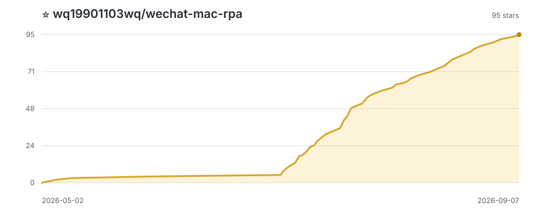

# WeChat Mac RPA


[中文文档](README.md) | **English**

Let AI "watch" your WeChat interface and auto-reply messages. **No protocol reverse engineering, no database access, no code injection** — WeChat UI updates won't break it.

A macOS WeChat automation framework built on **multimodal visual perception** and **LLM Agent**. Instead of hacking protocols or hooking into WeChat's internals, we treat WeChat as a pure black-box GUI application: computer vision reads the screen, large language models understand conversations, and system-level automation operates the interface. When WeChat updates its UI, it's just a new set of visual input — no need to chase protocol changes.

Core design: **Perception → Reasoning → Action → Memory → Data Flywheel**, five subsystems forming a complete cognitive loop.

---

## Why This Project?

If you've worked on WeChat automation, you know the pain:

- **Protocol reverse engineering** (itchat, iPad protocol, PC Hook): High ban risk. WeChat updates break everything. Maintenance nightmare.
- **Commercial RPA tools** (UiPath, 影刀/WinAutomation, etc.): Cost $800-$30,000+/year. Most don't support macOS at all. Even the ones that do have incomplete Mac support.
- **This project**: Uses multimodal AI to visually perceive the WeChat interface. No protocol, no ban risk. macOS native. API costs literally pennies per day.

---

## Key Features

### 1. Visual RPA — AI Sees the Screen

The bot takes screenshots of the WeChat window and uses a multimodal LLM (qwen3.6-flash) to extract message content, sender info, and unread counts. A pixel-diff pre-check skips unchanged screenshots entirely — zero API calls when nothing changes.

### 2. Digital Twin — Replicates Your Personality

Import your WeChat chat history to build a personal memory system. The bot learns your communication style — your favorite particles (哈, 吧, 啊), your short-burst messaging pattern, your relationships with different contacts. It doesn't reply like a chatbot; it replies like **you**.

In a real-world Turing test, the bot ran in a WeChat group chat for half a day before anyone noticed it wasn't the real person.

### 3. Multi-Agent Architecture

Two-tier routing based on task complexity:

- **Lightweight ReAct Agent**: Handles daily conversations — analyzes intent, calls tools (memory search, web search, URL browsing), iterates reasoning.
- **Deep Reasoning Path**: When a complex Skill is matched, switches to a long-context model (OpenClaw / Hermes) for single-turn deep reasoning.

### 4. Skill System — Extensible via Markdown

Bot capabilities aren't hardcoded — they're loaded dynamically via Markdown skill cards. Drop a `.md` file into `skills/` and the bot instantly gains new abilities.

Built-in skills include:

- **Smart Home Control** (tuya_smart_home): Control lights, AC, curtains via WeChat messages. "Turn on the living room light" → done. "Sleep mode" → lights off, curtains closed, AC set to 27°C.
- **3D Print Automation**: Manage Bambu Lab printers — check status, scale models, modify supports, all from WeChat.
- **Casual chat, Q&A, group banter, investment discussion**, and more.

### 5. Three-Layer Memory System

```
Prompt = Working Memory (recent N messages)
       + Session Memory (who they are, relationship, preferences)
       + Long-term Memory (LLM Wiki + BGE semantic vector index)
```

The bot inherits all your chat history on day one. It knows what you've discussed with each person, their preferences, your shared topics. Semantic search via `BAAI/bge-small-zh-v1.5` (ONNX, 512-dim, runs locally).

Persistent chat data and memory indexes are stored locally. When an external LLM or multimodal API is enabled, the prompts or screenshots required for inference are sent to the configured API provider.

### 6. Benchmarks

| Benchmark | Result |
|-----------|-------:|
| **Reply Quality** | **91.7%** (22/24) |
| **Tool Decision · Regular** | **100%** (22/22) |
| **Memory Search** | **96.6%** (28/29) |
| **OCR · Representative Pass Rate** | **93.1%** (27/29) |
| **OCR · Chat Name** | **96.6%** |
| **OCR · Message Count** | **93.1%** |
| **OCR · Sender** | **93.6%** |
| **OCR · Text** | **93.5%** |

### 7. Data Flywheel — On-Policy Iteration

Calibrate an LLM-as-Judge with a small amount of human annotation. Once the Judge's scoring aligns with human judgment, it takes over all subsequent experiment evaluation automatically. Human effort is invested only where it matters most — and every minute amplifies the automation capability of the flywheel.

---

## Quick Start

- **Environment**: macOS 12+, Python 3.10+, WeChat Mac
- **Install**: `pip install -r requirements.txt`
- **Config**: Copy `.env.example` to `.env`, fill in API keys
- **Permissions**: Enable Screen Recording and Accessibility for your terminal (System Settings → Privacy & Security)
- **Run**: `python3 run_bot.py`
- **Test**: Install development dependencies with `pip install -r requirements-dev.txt`, then run `python3 -m pytest src/tests -v`

For detailed setup, see `docs/01-quickstart/AI_QUICKSTART.md`.

---

## Required Permissions

| Permission | Purpose | Location |
|-----------|---------|----------|
| Screen Recording | `screencapture` to capture WeChat window | System Settings → Privacy & Security → Screen Recording |
| Accessibility | AppleScript to control WeChat window (click, type, activate) | System Settings → Privacy & Security → Accessibility |
| Automation | System Events inter-process communication | Granted on first run via popup |

> If screenshots fail, clicks don't work, or messages go to the wrong app, check these permissions first.
> Grant permissions to the application that **actually launches the Bot**. For production, use a regular terminal or LaunchAgent instead of launching directly from an automated development environment such as Codex or Claude Code. If capture fails, run `screencapture -x /tmp/wechat-test.png`; if that also fails, troubleshoot host permissions or the WeChat runtime environment before changing the capture code.

---

## Comparison

| | Protocol Reverse | Commercial RPA | This Project |
|---|---|---|---|
| **Ban Risk** | High | Low | Low |
| **macOS Support** | N/A | Most don't support Mac | Native |
| **Cost** | Low (but ban cost) | $800-$30,000+/year | API cost, pennies/day |
| **WeChat Updates** | Breaks everything | Medium (re-record flows) | Low (AI re-reads screen) |
| **Memory** | None | None | Three-layer + vector index |
| **Reply Style** | Depends on your code | RPA doesn't handle replies | Digital twin, mimics your tone |
| **Extensibility** | High but very hard | Medium (visual drag-drop) | High (Markdown skill cards) |
| **Smart Home/IoT** | None | Needs extra dev | Built-in Tuya skill |

---

## Project Structure

```
wechat-mac-rpa/
├── src/
│   ├── bot/               # Main loop orchestration
│   ├── perception/        # SmartPipeline / VisionPipeline
│   ├── memory/            # Three-layer memory (Working/Session/Long-term)
│   ├── reply/             # Reply generation (Agent runtime + dual-model routing)
│   ├── tools/             # Tool registry + built-in tools
│   ├── action/            # UI interaction / message sending
│   └── tests/             # 9 benchmark suites + unit tests
├── skills/                # Pluggable skills (Markdown)
├── docs/                  # Full documentation
├── prompts/               # System prompt templates
└── run_bot.py             # Production entry point
```

---

## License

[MIT License](LICENSE)

---

## Disclaimer

This project is for personal learning and research purposes only. Using automation tools to operate WeChat may violate WeChat's Terms of Service. Please assess the risks yourself. The author is not responsible for any consequences of use.

---

## Star History

[](https://github.com/example-owner/wechat-mac-rpa/stargazers)

---

If this project inspires you, please consider giving it a ⭐ — it's the best encouragement for open source.
